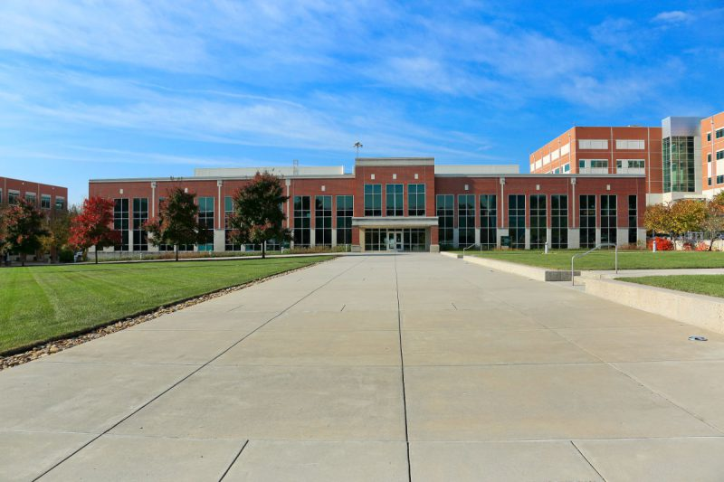

# About

The Experimental Computing Laboratory \(ExCL\) was established in 2004 with the goal of providing application users and computer scientists with access to systems with leading edge architectures and software.

ExCL is managed by the ORNL [Future Technologies Group](http://ft.ornl.gov/).  ExCL researchers investigate architectures such as multi- and many-core processors, Graphics Processing Units \(GPUs\), non-volatile memory systems, and Field Programmable Gate Arrays \(FPGAs\).

Over the years ExCL has adapted to the demands of the researchers of the Future Technologies Group and their collaborators. Now ExCL is opening to all researchers throughout the world that work in Computer Science research. ExCL aims at being an open and collaborative platform where cutting-edge computing research takes place.

ExCL is a production research facility. It provides the flexibility of pure research systems while offering a production-quality service and support. This support also includes an active role by researchers of the Future Technologies Group. These researchers will share their expertise and knowledge about the system and technologies with the users of the facility.

Explore the currently supported hardware, the upcoming resources that ExCL will provide,… If you need anything else, please let us know. If your workflow cannot be accommodated in the current ExCL infrastructure, also contact us and we will try to work it out. Happy computing!

